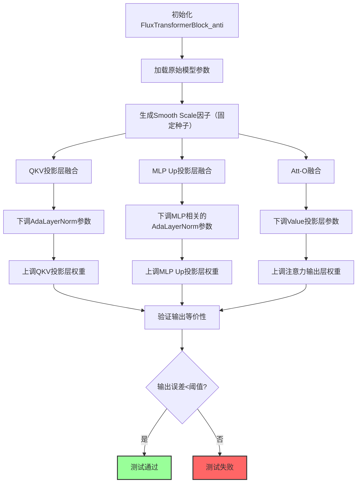
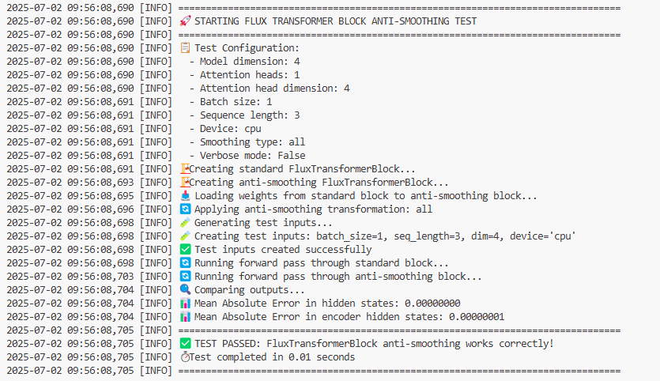

## 原仓的README

详情参考：
 - [源仓README.md](README-0.md)
 - [源仓代码仓URL](https://modelers.cn/models/MindIE/FLUX.1-dev)


## 本仓的README

本仓主要是在原仓的基础上，增加了SmoothQuant方案的设计与验证。
本仓特性 | 说明
--- | ---
[SmoothQuant方案设计与验证](https://hhqx.github.io/FLUX.1-dev/SmoothQuantInFlux.html) | 聚焦SmoothQuant量化在多模态AdaNorm场景下的应用，对于多模态中AdaNorm-Linear子图的scale融合方案设计与验证，并提供了验证流程图和demo代码。


### SmoothQuant方案的设计与验证

SmoothQuant方案是针对多模态AdaNorm场景下的量化需求设计的，主要包括以下几个步骤：

1. 确定融合策略：SmoothQuant方案关注AdaNorm-Linear子图的scale融合，设计了QKV投影层和MLP Up投影层的参数重校准策略。
2. 生成Smooth Scale因子：为保证计算等价性，需根据模型参数生成Smooth Scale因子。
3. 重校准模型参数：根据融合策略和生成的Smooth Scale因子，重校准模型参数。

详情参考：
- [SmoothQuant验证方案](docs/SmoothQuantInFlux.md)
- [SmoothQuant验证demo代码](tests/test_anti_smooth/test_flux_double_anti.py)

- 验证流程图：





#### 快速开始

##### 运行验证代码：
```
# Install
pip install git+https://github.com/hhqx/FLUX.1-dev.git

# 运行验证代码
python -m tests.test_anti_smooth.test_flux_double_anti
```

**验证结果示例**：


输出结果：
> $ python -m tests.test_anti_smooth.test_flux_double_anti



