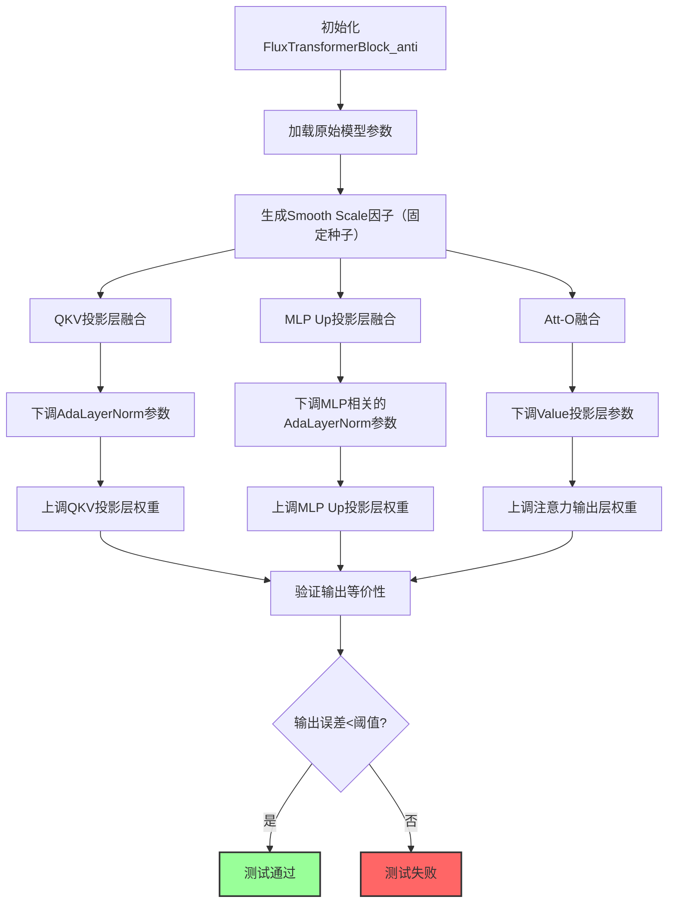
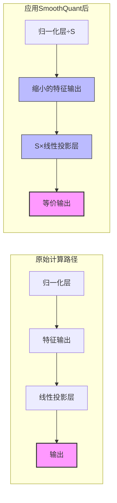
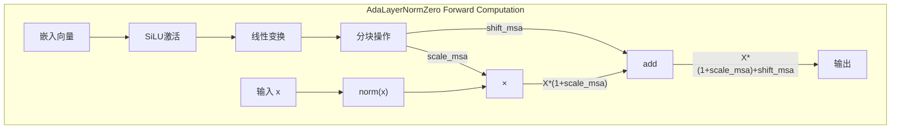
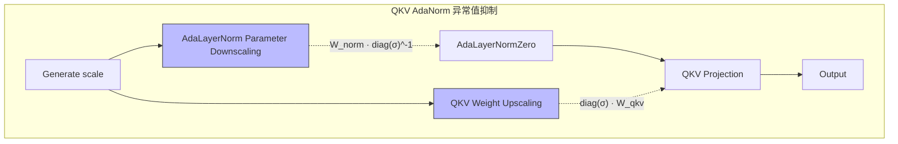
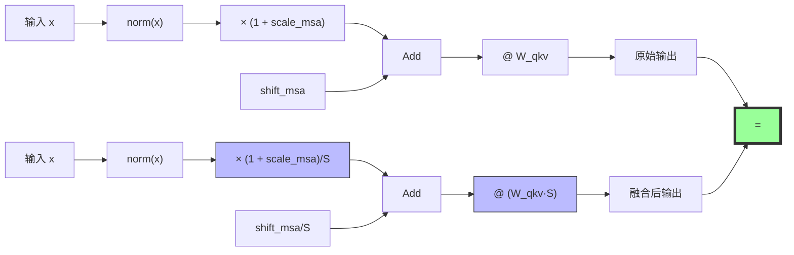
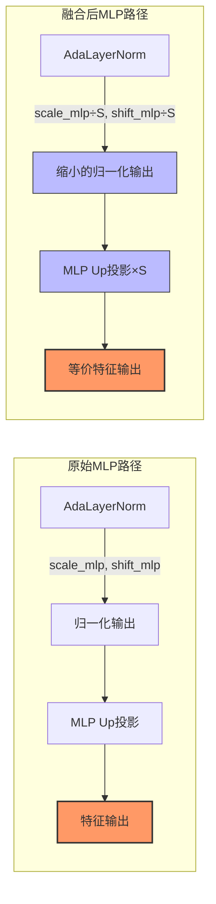
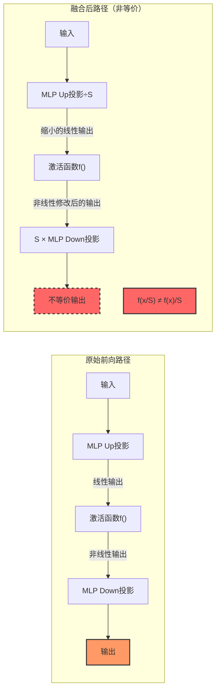
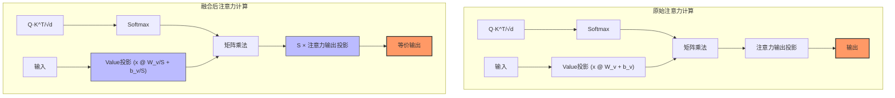
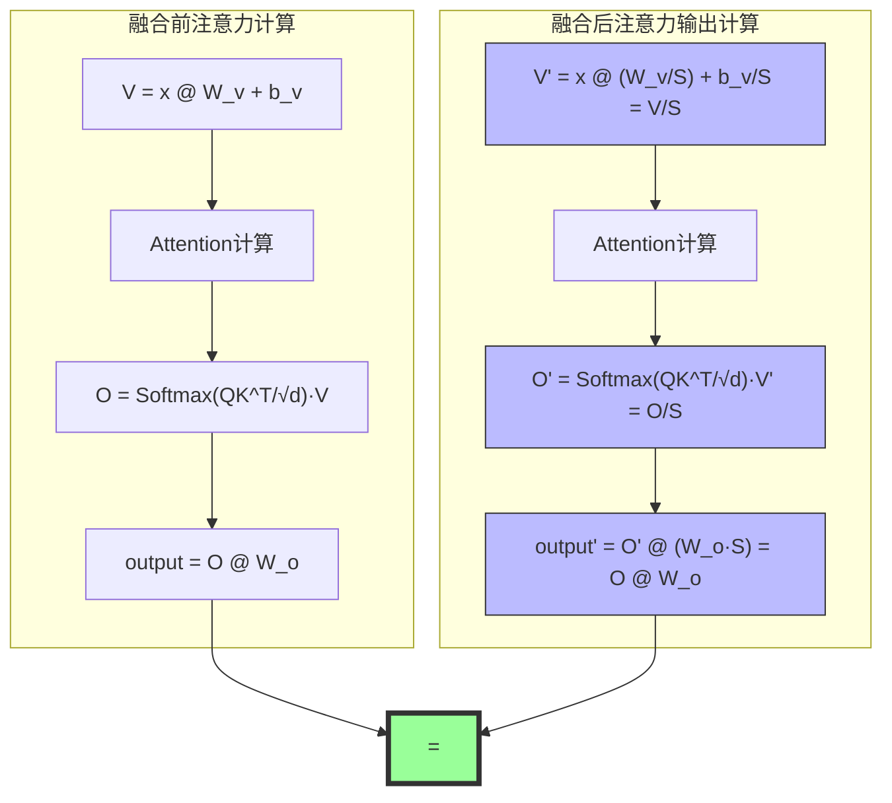

### SmoothQuant尺度融合策略在高效Transformer量化中的应用
- 仓库README链接：[README.md](https://github.com/hhqx/FLUX.1-dev/blob/main/README.md)
- 本文件 md 源码链接：[SmoothQuantInFlux.md](https://github.com/hhqx/FLUX.1-dev/blob/main/docs/SmoothQuantInFlux.md)

---
### 快速开始

#### 算法实现与验证demo

代码详情参考 [test_flux_double_anti.py](https://github.com/hhqx/FLUX.1-dev/blob/main/tests/test_anti_smooth/test_flux_double_anti.py)



**验证指标**：  
$$
\text{输出误差} \quad \delta_y = \max_{i} \left| y_i^{\text{(orig)}} - y_i^{\text{(fused)}} \right|
$$
要求$\delta_y < 10^{-5}$以保证数值等价性。

##### 运行验证代码：

- Install from pip+git
```shell
pip install git+https://github.com/hhqx/FLUX.1-dev.git
```


- [Optional] install from source
```shell
# git clone <This repo>
git clone git@github.com:hhqx/FLUX.1-dev.git

cd FLUX.1-dev
pip install -e .
```


```
# 运行验证代码
python -m tests.test_anti_smooth.test_flux_double_anti
```

**验证结果示例**：


输出结果：
> $ python -m tests.test_anti_smooth.test_flux_double_anti


---
#### 第一章 绪论  
**1.1 研究背景**  
随着Transformer模型规模的不断扩大，模型量化成为降低计算资源需求的关键技术。然而，传统量化方法在非线性操作密集的Transformer架构中面临显著精度损失。SmoothQuant通过参数重校准技术，在维持计算等价性的前提下提升模型量化友好性，其核心在于尺度因子融合策略的创新设计。



**1.2 研究内容**  
本章聚焦SmoothQuant在Transformer量化中的尺度融合机制，通过数学建模严格推导其在四类关键组件（QKV投影-归一化层、MLP上行投影-归一化层、MLP下行投影-上行投影层、注意力输出层-Value投影层）的等价性与非等价性条件，为高效量化提供理论基础。

---

#### 第二章 SmoothQuant尺度融合在多模态AdaNorm中的设计与实现

##### 2.1 QKV投影与AdaLayerNorm融合的等价性方案

**建模过程**：  
设输入$\mathbf{x} \in \mathbb{R}^{d}$，AdaLayerNormZero输出：
$$
\mathbf{h} = \underbrace{\text{norm}(\mathbf{x})}_{\text{归一化}} \odot \underbrace{(1 + \mathbf{g}_{\text{msa}})}_{\text{自适应缩放}} + \underbrace{\mathbf{s}_{\text{msa}}}_{\text{自适应平移}}
$$



QKV投影输出：
$$
\mathbf{y} = \mathbf{h} \mathbf{W}_{\text{qkv}}, \quad \mathbf{W}_{\text{qkv}} \in \mathbb{R}^{d \times 3d}
$$

**尺度融合变换**：  
1. 生成尺度因子：$$\boldsymbol{\sigma} = 2 + |\mathcal{N}(0, \mathbf{I})| \in \mathbb{R}^{d}$$（确定性生成）  
2. 归一化层参数降尺度：
   $$
   \begin{aligned}
   \mathbf{W}_{\text{norm,shift}}' &= \mathbf{W}_{\text{norm,shift}} \cdot \text{diag}(\boldsymbol{\sigma})^{-1} \\
   \mathbf{b}_{\text{norm,shift}}' &= \mathbf{b}_{\text{norm,shift}} \cdot \text{diag}(\boldsymbol{\sigma})^{-1} \\
   \mathbf{W}_{\text{norm,scale}}' &= \mathbf{W}_{\text{norm,scale}} \cdot \text{diag}(\boldsymbol{\sigma})^{-1} \\
   \mathbf{b}_{\text{norm,scale}}' &= (\mathbf{b}_{\text{norm,scale}} + \mathbf{1}) \cdot \text{diag}(\boldsymbol{\sigma})^{-1} - \mathbf{1}
   \end{aligned}
   $$
3. QKV投影升尺度：
   $$
   \mathbf{W}_{\text{qkv}}' = \text{diag}(\boldsymbol{\sigma}) \cdot \mathbf{W}_{\text{qkv}}
   $$



此时：
$$(1 + \mathbf{g}_{\text{msa}}') =  (1 + \mathbf{g}_{\text{msa}}) \text{diag}(\boldsymbol{\sigma})^{-1}
$$

$$\mathbf{s}_{\text{msa}}' = \mathbf{s}_{\text{msa}} \cdot \text{diag}(\boldsymbol{\sigma})^{-1}
$$

**等价性证明**：  
原始输出：
$$
\mathbf{y} = \mathbf{h} \mathbf{W}_{\text{qkv}} = \left[ \text{norm}(\mathbf{x}) \odot (1 + \mathbf{g}_{\text{msa}}) + \mathbf{s}_{\text{msa}} \right] \mathbf{W}_{\text{qkv}}
$$
融合后输出：
$$
\begin{aligned}
\mathbf{y}' &= \left[ \text{norm}(\mathbf{x}) \odot (1 + \mathbf{g}_{\text{msa}}') + \mathbf{s}_{\text{msa}}' \right] \mathbf{W}_{\text{qkv}}' \\
&= \left[ \text{norm}(\mathbf{x}) \odot \left( (1 + \mathbf{g}_{\text{msa}}) \text{diag}(\boldsymbol{\sigma})^{-1} \right) + \mathbf{s}_{\text{msa}} \text{diag}(\boldsymbol{\sigma})^{-1} \right] \left( \text{diag}(\boldsymbol{\sigma}) \mathbf{W}_{\text{qkv}} \right) \\
&= \left( \mathbf{h} \cdot \text{diag}(\boldsymbol{\sigma})^{-1} \right) \left( \text{diag}(\boldsymbol{\sigma}) \mathbf{W}_{\text{qkv}} \right) \\
&= \mathbf{h} \cdot \underbrace{\text{diag}(\boldsymbol{\sigma})^{-1} \text{diag}(\boldsymbol{\sigma})}_{\mathbf{I}} \cdot \mathbf{W}_{\text{qkv}} \\
&= \mathbf{y}
\end{aligned}
$$
故$$\mathbf{y}' \equiv \mathbf{y}$$，计算等价性得证。



##### 2.2 MLP up投影层与AdaLayerNorm融合的等价性方案

**建模过程**：  
设输入向量为 $\mathbf{x} \in \mathbb{R}^{1 \times d_{\text{in}}}$，上行投影权重矩阵为 $\mathbf{W}_{\text{up}} \in \mathbb{R}^{d_{\text{in}} \times d_{\text{hid}}}$，偏置向量为 $\mathbf{b}_{\text{up}} \in \mathbb{R}^{1 \times d_{\text{hid}}}$。

上行投影输出为：
$$
\mathbf{u} = \mathbf{x} \mathbf{W}_{\text{up}} + \mathbf{b}_{\text{up}}
$$

其中 $\mathbf{u} \in \mathbb{R}^{1 \times d_{\text{hid}}}$。



**尺度融合变换**：  
定义对角尺度矩阵 $\mathbf{S} = \operatorname{diag}(\boldsymbol{\sigma}) \in \mathbb{R}^{d_{\text{hid}} \times d_{\text{hid}}}$，其中 $\boldsymbol{\sigma} = (\sigma_1, \sigma_2, \dots, \sigma_{d_{\text{hid}}})^\top > \mathbf{0}$。

MLP上行投影参数变换：
$$
\mathbf{W}_{\text{up}}' = \text{diag}(\boldsymbol{\sigma}) \cdot \mathbf{W}_{\text{up}}, \quad \mathbf{s}_{\text{mlp}}' = \mathbf{s}_{\text{mlp}} \cdot \text{diag}(\boldsymbol{\sigma})^{-1}, \quad 1 + \mathbf{g}_{\text{mlp}}' = (1 + \mathbf{g}_{\text{mlp}}) \cdot \text{diag}(\boldsymbol{\sigma})^{-1}
$$

融合后计算过程：
$$
\begin{aligned}
\mathbf{z}' &= [\text{norm}(\mathbf{x}) \odot (1 + \mathbf{g}'_{\text{mlp}}) + \mathbf{s}'_{\text{mlp}}] @ \mathbf{W}'_{\text{up}} \\
&= [\text{norm}(\mathbf{x}) \odot ((1 + \mathbf{g}_{\text{mlp}}) \cdot \text{diag}(\boldsymbol{\sigma})^{-1}) + \mathbf{s}_{\text{mlp}} \cdot \text{diag}(\boldsymbol{\sigma})^{-1}] @ (\text{diag}(\boldsymbol{\sigma}) \cdot \mathbf{W}_{\text{up}}) \\
&= [(\text{norm}(\mathbf{x}) \odot (1 + \mathbf{g}_{\text{mlp}}) + \mathbf{s}_{\text{mlp}}) \cdot \text{diag}(\boldsymbol{\sigma})^{-1}] @ (\text{diag}(\boldsymbol{\sigma}) \cdot \mathbf{W}_{\text{up}}) \\
&= (\mathbf{h} \cdot \text{diag}(\boldsymbol{\sigma})^{-1}) @ (\text{diag}(\boldsymbol{\sigma}) \cdot \mathbf{W}_{\text{up}}) \\
&= \mathbf{h} @ (\text{diag}(\boldsymbol{\sigma})^{-1} \cdot \text{diag}(\boldsymbol{\sigma})) @ \mathbf{W}_{\text{up}} \\
&= \mathbf{h} @ \mathbf{I} @ \mathbf{W}_{\text{up}} \\
&= \mathbf{h} @ \mathbf{W}_{\text{up}} \\
&= \mathbf{z}
\end{aligned}
$$

##### 2.3 MLP下行投影融合的非等价性

**建模过程**：  
设输入向量为 $\mathbf{x} \in \mathbb{R}^{1 \times d_{\text{in}}}$，上行投影权重矩阵为 $\mathbf{W}_{\text{up}} \in \mathbb{R}^{d_{\text{in}} \times d_{\text{hid}}}$，偏置向量为 $\mathbf{b}_{\text{up}} \in \mathbb{R}^{1 \times d_{\text{hid}}}$。

上行投影输出为：
$$
\mathbf{u} = \mathbf{x} \mathbf{W}_{\text{up}} + \mathbf{b}_{\text{up}}
$$

其中 $\mathbf{u} \in \mathbb{R}^{1 \times d_{\text{hid}}}$。  

激活函数 $f: \mathbb{R} \to \mathbb{R}$ 逐元素作用于向量：
$$
\mathbf{v} = f(\mathbf{u}) = \begin{bmatrix} f(u_1) & f(u_2) & \cdots & f(u_{d_{\text{hid}}}) \end{bmatrix}
$$
下行投影权重矩阵为 $\mathbf{W}_{\text{down}} \in \mathbb{R}^{d_{\text{hid}} \times d_{\text{out}}}$，最终输出：
$$
\mathbf{y} = \mathbf{v} \mathbf{W}_{\text{down}}
$$



**尺度融合变换**：
定义对角尺度矩阵 $\mathbf{S} = \operatorname{diag}(\boldsymbol{\sigma}) \in \mathbb{R}^{d_{\text{hid}} \times d_{\text{hid}}}$，其中 $\boldsymbol{\sigma} = (\sigma_1, \sigma_2, \dots, \sigma_{d_{\text{hid}}})^\top > \mathbf{0}$。  

1. **上行投影参数变换**：  
   $$
   \mathbf{W}_{\text{up}}' = \mathbf{W}_{\text{up}} \mathbf{S}^{-1}, \quad \mathbf{b}_{\text{up}}' = \mathbf{b}_{\text{up}} \mathbf{S}^{-1}
   $$
   变换后上行投影输出：
   $$
   \mathbf{u}' = \mathbf{x} \mathbf{W}_{\text{up}}' + \mathbf{b}_{\text{up}}' = (\mathbf{x} \mathbf{W}_{\text{up}} + \mathbf{b}_{\text{up}}) \mathbf{S}^{-1} = \mathbf{u} \mathbf{S}^{-1}
   $$

2. **下行投影参数变换**：  
   $$
   \mathbf{W}_{\text{down}}' = \mathbf{S} \mathbf{W}_{\text{down}}
   $$

**非等价性分析**：  
融合后输出：
$$
\mathbf{y}' = f(\mathbf{u}') \mathbf{W}_{\text{down}}' = f(\mathbf{u} \mathbf{S}^{-1}) (\mathbf{S} \mathbf{W}_{\text{down}})
$$

原始输出：
$$
\mathbf{y} = f(\mathbf{u}) \mathbf{W}_{\text{down}}
$$

**等价性条件**：  
要使 $\mathbf{y}' = \mathbf{y}$，需满足：
$$
f(\mathbf{u} \mathbf{S}^{-1}) \mathbf{S} = f(\mathbf{u})
$$
即对每个分量 $j$：
$
f\left( \frac{u_j}{\sigma_j} \right) \sigma_j = f(u_j)
$

对于非线性函数（如GELU或SiLU），这一等式不成立，即：
$$\text{activation}(\mathbf{u} \cdot \text{diag}(\boldsymbol{\sigma})^{-1}) \neq \text{activation}(\mathbf{u}) \cdot \text{diag}(\boldsymbol{\sigma})^{-1}$$

##### 2.4 注意力输出层融合的等价性方案
**建模过程**：  
Value投影输出：
$$
\mathbf{V} = \mathbf{X} \mathbf{W}_v + \mathbf{b}_v
$$
注意力权重：
$$
\mathbf{A} = \text{softmax}\left( \frac{\mathbf{Q}\mathbf{K}^\top}{\sqrt{d}} \right)
$$
输出投影：
$$
\mathbf{y} = (\mathbf{A} \mathbf{V}) \mathbf{W}_o
$$



**尺度融合变换**：  
1. Value投影降尺度：
   $$
   \mathbf{W}_v' = \mathbf{W}_v \text{diag}(\boldsymbol{\sigma})^{-1}, \quad \mathbf{b}_v' = \mathbf{b}_v \cdot \text{diag}(\boldsymbol{\sigma})^{-1}
   $$
2. 输出投影升尺度：
   $$
   \mathbf{W}_o' =\text{diag}(\boldsymbol{\sigma})  \mathbf{W}_o 
   $$

**等价性证明**：  
融合后计算路径：
$$
\begin{aligned}
\mathbf{V}' &= \mathbf{V}  \text{diag}(\boldsymbol{\sigma})^{-1} \\
\mathbf{O}' &= \mathbf{A} \mathbf{V}' \\
  &= \mathbf{A} \mathbf{V}  \text{diag}(\boldsymbol{\sigma})^{-1} \\
  &= \mathbf{O}  \text{diag}(\boldsymbol{\sigma})^{-1} \\

\mathbf{y}' &= \mathbf{O}' \mathbf{W}_o' \\
 &= \left( \mathbf{O} \text{diag}(\boldsymbol{\sigma})^{-1} \right) \left( \text{diag}(\boldsymbol{\sigma} \mathbf{W}_o ) \right) \\
  &= \mathbf{O} \underbrace{\text{diag}(\boldsymbol{\sigma})^{-1} \text{diag}(\boldsymbol{\sigma})}_{\mathbf{I}} \mathbf{W}_o\\ 
  &= \mathbf{y}
\end{aligned}
$$
线性矩阵乘法保持运算等价性。



---


#### 第四章 结论与讨论
1. **理论贡献**：  
   - 严格证明SmoothQuant在**线性投影-归一化层**组合中的计算等价性  
   - 揭示**非线性激活函数**是破坏MLP下行投影等价性的根本原因  
   - 建立注意力机制中跨层尺度融合的可行性条件  

2. **工程指导**：  
   | 组件类型 | 可融合性 | 关键约束 |  
   |---|---|---|  
   | QKV投影+归一化 | ✓ | 尺度因子同步更新 |  
   | MLP上行+归一化 | ✓ | 偏置项特殊处理 |  
   | MLP下行+上行 | ✗ | 非线性激活不可逆 |  
   | 注意力输出+Value | ✓ | 矩阵乘法线性性 |  

---
#### AdaNorm 融合前后权重参数对照表

| 参数            | 原始值 | 融合后值                 | 维度      | 代码实现                                                                 |
|-----------------|--------|------------------------------|-----------|--------------------------------------------------------------------------|
| $W_{norm,shift}$ | $W$    | $\frac{W}{\boldsymbol{\sigma}}$ | $(\ast, D)$ | `norm1.linear.weight.data[:dim].div_(scale.view(-1, 1))`                |
| $b_{norm,shift}$ | $b$    | $\frac{b}{\boldsymbol{\sigma}}$ | $(D,)$     | `norm1.linear.bias.data[:dim].div_(scale)`                               |
| $W_{norm,scale}$ | $W$    | $\frac{W}{\boldsymbol{\sigma}}$ | $(\ast, D)$ | `norm1.linear.weight.data[dim:2*dim].div_(scale.view(-1, 1))`           |
| $b_{norm,scale}$ | $b$    | $\frac{b+1}{\boldsymbol{\sigma}} -1$ | $(D,)$     | `norm1.linear.bias.data[dim:2*dim] = (bias_slice + 1) / scale - 1`      |
| $W_{qkv}$       | $W$    | $\boldsymbol{\sigma} \otimes W$ | $(D, \ast)$ | `linear.weight.data.mul_(scale.view(1, -1))`                            |

> **表示约定说明**：
> 1. **数学表示**（列优先存储）：
>    - 线性层运算：$\mathbf{Y} = \mathbf{X}W_{norm, scale} + \mathbf{b}$
>    - 权重维度：$W_{norm, scale} \in \mathbb{R}^{\ast \times D}$
>   
> 2. **代码实现**（行优先存储）：
>    - 线性层运算：$\mathbf{Y} = \mathbf{X}W_{norm, scale}^\top + \mathbf{b}$
>    - 权重维度：$W_{norm,scale} \in \mathbb{R}^{D \times \ast}$
> 
> 3. **操作符说明**：
>    - $D$：表示异常值抑制的维度，即AdaNorm的输出维度，与QKV投影层输入维度一致
>    - $\boldsymbol{\sigma}$：尺度因子向量，通过 $\text{diag}(\boldsymbol{\sigma})$ 构造对角矩阵
>    - $\otimes$：表示矩阵乘法 $\text{diag}(\boldsymbol{\sigma}) \cdot W$（维度适配广播）
>    - $\frac{\square}{\boldsymbol{\sigma}}$：表示逐元素除以尺度因子

---


#### 附录：数学符号表
| 符号 | 含义 | 维度 |  
|---|---|---|  
| $$\mathbf{W}_{\text{qkv}}$$ | QKV投影权重 | $$\mathbb{R}^{d \times 3d}$$ |  
| $$\mathbf{g}_{\text{msa}}$$ | 自注意力缩放因子 | $$\mathbb{R}^{d}$$ |  
| $$\boldsymbol{\sigma}$$ | 尺度因子向量 | $$\mathbb{R}^{d}$$ |  
| $$\text{diag}(\cdot)$$ | 对角矩阵化算子 | - |  
| $$\odot$$ | 逐元素乘法 | - |  
| $$f(\cdot)$$ | 非线性激活函数 | - |

### 安装与运行

#### 安装方法

提供两种安装方式：

1. **从源代码安装** (推荐用于开发)
```bash
# 克隆项目仓库
git clone git@github.com:hhqx/FLUX.1-dev.git

# 进入项目目录
cd FLUX.1-dev

# 以开发模式安装
pip install -e .
```

2. **直接从GitHub安装** (适用于快速试用)
```bash
pip install git+https://github.com/hhqx/FLUX.1-dev.git
```

#### 运行测试

执行验证测试脚本：

```bash
# 基础运行
python -m tests.test_anti_smooth.test_flux_double_anti

# 详细模式运行（显示完整日志）
python -m tests.test_anti_smooth.test_flux_double_anti --verbose
```

更多运行选项请参考：
```bash
python -m tests.test_anti_smooth.test_flux_double_anti --help
```